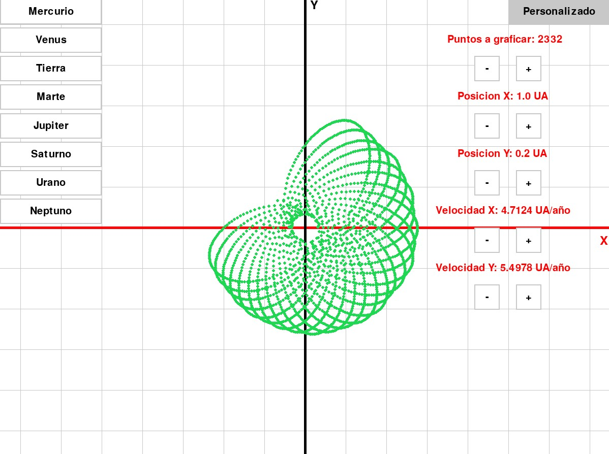
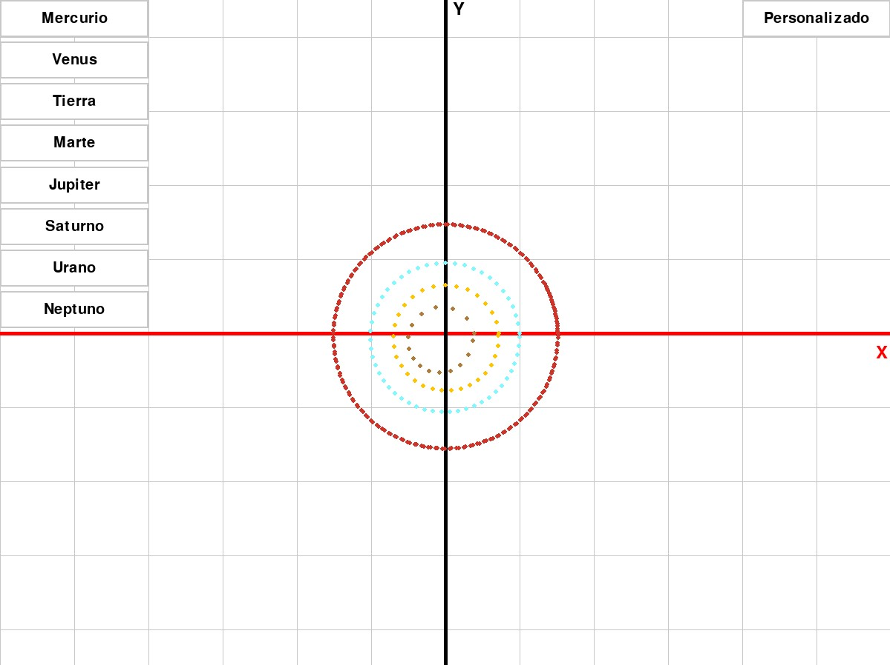
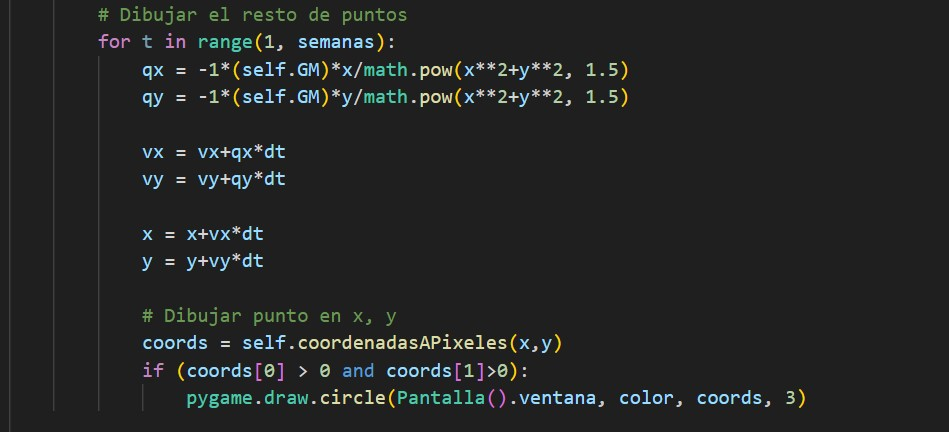

# Simulador de Física

## Descripción

Este programa tiene la capacidad de gráficar las ortbitas de los 8 planetas del sistema solar, a demás de un planeta personalizado por el usuario.

## Gráfica de orbitas planetarias

## Dependencias

### Pygame

Libreria sobre la que se basa este proyecto.

Para instalar pygame en windows debes tener python instalado y asegurarte de que sus variables de entorno estan configuradas.

Una vez hecho eso usa este comando en una terminal:

    pip install pygame

### Numpy

Libreria para resolver ecuaciones y así poder graficarlas.

    pip install numpy